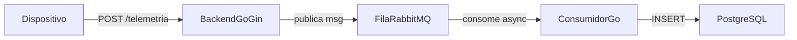

# PonderadaBackInfraMurilo

Este repositório é a minha entrega da atividade de backend/infra com Go, RabbitMQ e PostgreSQL.
Montei um fluxo assíncrono simples, estável e fácil de rodar.

## Objetivo do projeto

Receber telemetria dos dispositivos sem processar tudo dentro da requisição HTTP.

Fluxo final:
1. a API recebe `POST /telemetria`
2. valida o payload
3. publica na fila RabbitMQ
4. o consumidor pega da fila
5. grava no PostgreSQL

Com isso, evito gargalo no endpoint e deixo o backend mais resiliente em concorrência.

## Arquitetura (resumo)



Serviços:
- `backend`: API Gin (`:8080`)
- `consumer`: consumidor da fila
- `rabbitmq`: broker (`:5672`) e painel (`:15672`)
- `postgres`: banco (`:5432`)

## Payload da API

```json
{
  "id_dispositivo": "disp-001",
  "instante": "2026-03-22T12:00:00Z",
  "tipo_sensor": "temperatura",
  "natureza_leitura": "analogico",
  "valor_coletado": "25.3"
}
```

Regras:
- `natureza_leitura`: `analogico` ou `discreto`
- `instante`: RFC3339
- resposta de sucesso: `202` com `{"situacao":"enfileirado"}`

## Estrutura mínima

```text
.
├── backend/
├── consumer/
├── db/init.sql
├── docker-compose.yml
├── loadtest/telemetria.js
└── reports/k6-summary.md
```

## Decisões que tomei e por quê

- **Fila entre API e banco**: usei para desacoplar ingestão de persistência e reduzir risco de travar endpoint.
- **Ack manual no consumidor**: só confirmo mensagem depois de gravar no banco, para reduzir risco de perda.
- **Fila durável + mensagem persistente**: adotei para ter comportamento melhor em reinício do broker.
- **Payload simples (valor como texto)**: escolhi para acelerar o MVP sem complicar parse por tipo de sensor.
- **Limite de CPU/memória no compose**: usei para reproduzir teste de carga em cenário controlado.

## Dificuldades reais no caminho (e como resolvi)

Durante a implementação, encontrei alguns problemas práticos:

1. **Ambiente sem ferramentas no PATH**
   - `go`, `docker` e `k6` não eram reconhecidos no terminal.
   - resolvi instalando via `winget` e reiniciando sessão do terminal/IDE.

2. **Docker instalado, mas daemon ainda não estava pronto**
   - `docker info` falhava porque o engine ainda não tinha subido.
   - resolvi iniciando Docker Desktop e aguardando o daemon ficar disponível.

3. **Build do consumer quebrando por dependência**
   - erro de `missing go.sum entry` no build Docker.
   - resolvi com `go mod tidy` em `backend` e `consumer`.

4. **Teste HTTP no PowerShell com comportamento inconsistente**
   - `curl` ficou pendurado em uma checagem.
   - troquei para `Invoke-RestMethod`, que foi mais estável no Windows.

5. **Teste de carga com CPU sem diferença no começo**
   - com `sleep(0.1)` no k6, a taxa ficou parecida entre `0.25` e `0.50`.
   - resolvi criando cenário de estresse com `SLEEP_SECONDS=0` e mais VUs.

6. **Backlog alto no estresse**
   - em pico forte, fila acumulou mensagens (esperado nesse volume).
   - validei drenagem completa depois e conferi que a persistência bateu com as requisições aceitas.

## Como operar o projeto (passo a passo)

### 1) Subir tudo

```bash
docker compose up --build -d
```

### 2) Conferir se está saudável

- API: `http://localhost:8080/health`
- RabbitMQ UI: `http://localhost:15672` (usuário/senha: `guest`/`guest`)

### 3) Fazer um teste manual de envio

```powershell
$body = @{
  id_dispositivo = "disp-manual-1"
  instante = "2026-03-22T12:00:00Z"
  tipo_sensor = "umidade"
  natureza_leitura = "analogico"
  valor_coletado = "54.1"
} | ConvertTo-Json

Invoke-RestMethod -Uri "http://localhost:8080/telemetria" -Method Post -ContentType "application/json" -Body $body
```

### 4) Rodar os testes unitários

```bash
cd backend && go test ./...
cd ../consumer && go test ./...
```

### 5) Rodar o teste de carga

Padrão:
```bash
k6 run loadtest/telemetria.js
```

Estresse (para evidenciar CPU):
```powershell
$env:SLEEP_SECONDS="0"
$env:MAX_VUS="120"
$env:RAMP_SECONDS="20"
$env:HOLD_SECONDS="40"
$env:RAMP_DOWN_SECONDS="20"
k6 run loadtest/telemetria.js
```

Parâmetros aceitos no script:
- `SLEEP_SECONDS`
- `MAX_VUS`
- `RAMP_SECONDS`
- `HOLD_SECONDS`
- `RAMP_DOWN_SECONDS`

### 6) Encerrar o ambiente

```bash
docker compose down -v
```

## Reprodutibilidade de carga (limites no compose)

Limites padrão que configurei:
- backend: `0.50` CPU / `256m`
- consumer: `0.50` CPU / `256m`
- rabbitmq: `0.50` CPU / `512m`
- postgres: `0.50` CPU / `512m`

Exemplo para rodar com menos CPU:

```powershell
$env:BACKEND_CPUS="0.25"
$env:CONSUMER_CPUS="0.25"
docker compose up --build -d
```

## Partes da atividade que foram feitas por AI

Eu usei AI desde o começo para **planejar o processo inteiro**.  
Passei as especificações da atividade e como eu queria montar a solução, e a AI me ajudou a criar um plano de ação (ordem de passos, prioridade e simplificações para entregar no prazo).

Durante o desenvolvimento, usei AI principalmente em partes mecânicas/cansativas e também quando eu travava em erro de execução/sintaxe (principalmente por ainda não ter muita experiência com Go).

Exemplos objetivos de uso:

1. **Correção de dependências e build (`go mod tidy` / `go.sum`)**  
   Em alguns momentos o build falhou por causa de dependência faltando no `go.sum`.  
   Pedi ajuda da AI para ajustar isso de forma correta e rápida.

2. **Ajustes rápidos de sintaxe e formulação em Go**  
   Teve trecho que a lógica estava certa, mas a escrita em Go estava errada ou incompleta.  
   Usei AI para corrigir esses pontos e destravar o código.

Em todas as vezes que usei AI, eu pedi para ela **explicar o porquê das mudanças** e **como aquilo funcionava**, para não só copiar, mas entender o que estava sendo alterado.

No final de tudo, eu também coloquei a atividade completa em uma AI e pedi uma avaliação geral para confirmar se a entrega estava adequada ao que foi pedido e pedi ajuda eu como fazer ou sobre oque fazer em alguns casos que não tinha conhecimento de como funcionavam as coisas, mas isso foi mais no sentido de pedir um passo a passo ou um tutorial simples.

Pedi para a AI comentar as áreas mais importantes do código. Depois disso, eu mesma revisei esses comentários, corrigi/adaptei o texto, acrescentei algumas informações e reescrevi trechos.

E por último pedi ajuda com as documentações, escrevi tudo que deveria ser escrito na documentação de maneira informal e depois pedi para ela organizar e melhorar a legibilidade. Depois disso fiz um onceover rápido para pegar qualquer erro.


## Onde está a evidência experimental

A evidência experimental está em `reports/k6-summary.md`.
Nesse arquivo eu registro:
- os cenários de carga que executei (base e estresse),
- os resultados principais (vazão, latência p95 e taxa de erro),
- o comportamento da fila e a conferência de persistência no banco,
- e a minha leitura dos gargalos com sugestões de melhoria.

## Estado final da entrega

Deixei o projeto funcional fim a fim:
- a API recebe, valida e enfileira
- o consumidor persiste no PostgreSQL
- os testes unitários passam
- os testes de carga foram executados
- o relatório com resultados está em `reports/k6-summary.md`

## Limites atuais (MVP)

- sem DLQ
- sem idempotência
- sem stack completa de observabilidade (métricas/dashboards)
